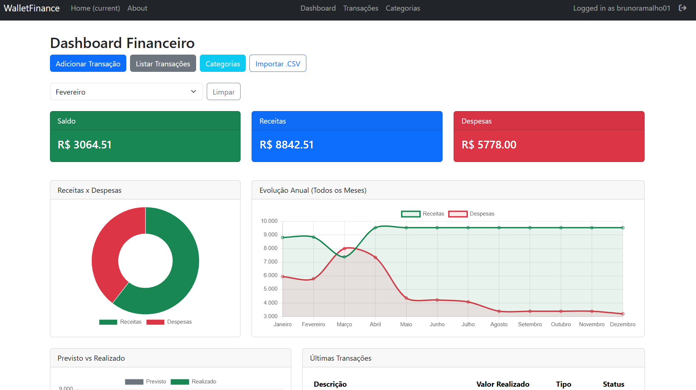
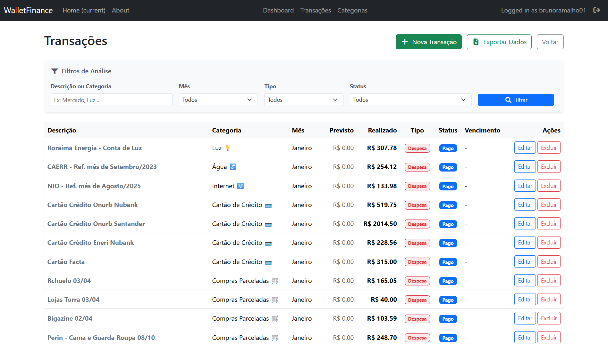
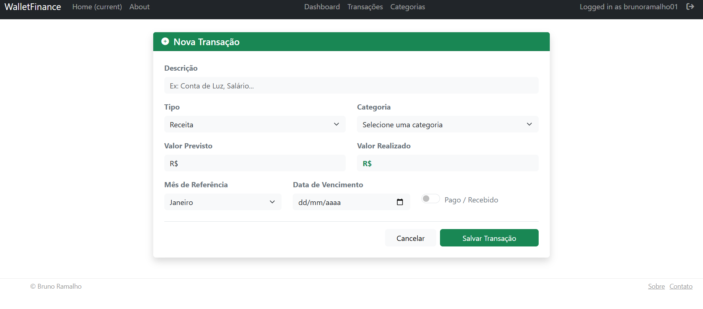
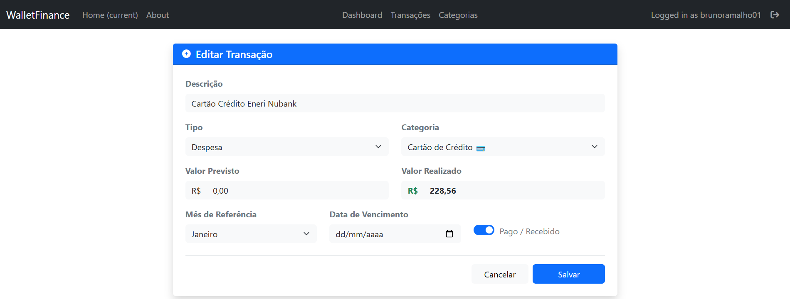

# WalletFinance 💰

Um aplicativo web moderno e completo para controle financeiro pessoal. Construído com Python, Flask e arquitetura limpa, o WalletFinance permite gerenciar receitas e despesas, importar dados em massa e visualizar a saúde financeira através de um dashboard analítico interativo.

🔗 **Acesse a aplicação ao vivo:** [walletfinance.onrender.com](https://walletfinance.onrender.com/)


---

## 🎯 O Propósito do Projeto

**O Problema:** O Brasil enfrenta um cenário financeiro desafiador. Dados recentes do Banco Central apontam que mais de **80% das famílias brasileiras possuem dívidas**, comprometendo cerca de 50% de sua renda anual — um recorde histórico. Aliado a isso, há uma profunda carência de educação financeira básica, especialmente entre a população de baixa e média renda. Ferramentas tradicionais, como planilhas complexas, muitas vezes geram atrito e afastam as pessoas do controle de seus próprios gastos.

**A Solução:** O WalletFinance nasceu com um objetivo claro: **descomplicar a gestão financeira**. Construído com Python e Flask, o projeto foca em uma interface limpa, didática e de fácil uso. A aplicação permite que qualquer pessoa, independentemente do seu nível de letramento tecnológico, consiga visualizar sua saúde financeira com facilidade. Através de dashboards interativos e organização inteligente, o sistema transforma números brutos em clareza visual, provando que a tecnologia deve ser uma ponte, e não uma barreira, para a educação financeira.

---

## 📸 Imagens do Projeto



*(Exemplo: Visão geral do Dashboard analítico)*


*(Exemplo: Gerenciamento e filtro de transações)*


*(Exemplo: Cadastro de Novas Transações)*


*(Exemplo: Edição de Novas Transações)*

---

## ✨ Principais Funcionalidades

* **Autenticação Segura:** Cadastro e login de usuários com proteção CSRF em todas as rotas e senhas criptografadas (Bcrypt).
* **Gestão de Transações:** CRUD completo (Criar, Ler, Atualizar, Deletar) de receitas e despesas.
* **Integração Relacional:** Categorias dinâmicas amarradas a transações. Alterar o nome de uma categoria atualiza todo o histórico.
* **UX Inteligente (Filtros JS):** Formulários dinâmicos que exibem categorias específicas baseadas no tipo de transação selecionada (Receita ou Despesa).
* **Filtros Avançados:** Busca em banco de dados por mês, tipo, status e descrição, com paginação *Server-side* para suportar milhares de registros.
* **Importação em Massa:** Ferramenta para upload de arquivos `.CSV` que processa centenas de linhas e cria categorias faltantes automaticamente.
* **Exportação de Dados:** Botão de exportação que gera relatórios `.CSV` perfeitamente formatados para o Excel brasileiro (com separação por ponto e vírgula).
* **Dashboard Analítico:** 5 Gráficos interativos (Chart.js) detalhando saldo, evolução anual, despesas por categoria e status de inadimplência.

---

## 🚀 Como executar o projeto localmente

Você pode rodar o WalletFinance utilizando o Docker (Recomendado) ou configurando um ambiente virtual Python tradicional.

### Opção 1: Usando Docker (Recomendado)

O uso do Docker garante que o aplicativo rode com as versões corretas de Python e Node.js, sem precisar instalar dependências diretamente na sua máquina.

1. **Clone o repositório:**
   ```bash
   git clone https://github.com/brunoramalho01/walletfinance.git
   
   cd walletfinance
   ```

2. **Inicie o servidor de desenvolvimento:**

   ```bash
   docker-compose up flask-dev
   ```

3. **Inicialize o Banco de Dados (Em outro terminal):**

   ```bash
   docker-compose run --rm manage db init
   docker-compose run --rm manage db migrate
   docker-compose run --rm manage db upgrade
   ```

   Acesse http://localhost:8080 no seu navegador.

  ### Opção 2: Instalação Manual (Virtualenv)
  
  1. **Clone o repositório e crie o ambiente virtual:**
  ```bash
   git clone https://github.com/brunoramalho01/walletfinance.git
   cd walletfinance
   python -m venv venv
   
   # Ativar o venv
   source venv/bin/activate  # No Linux
   venv\Scripts\activate # No Windows
   ```
   2. **Instale as dependências e construa o Front-end:**
   ```bash
   pip install -r requirements.txt
   npm install
   npm run build
   ```

   3. **Configure as variáveis de ambiente:**
  
   Crie um arquivo ```.env``` na raiz do projeto com base no ```.env.example.```

   4. **Inicialize o Banco de Dados (SQLite):**
   ```bash
   flask db init
   flask db migrate
   flask db upgrade
   ```
   5. **Inicie o servidor:**
   ```bash
   flask run
   ```
   Acesse http://localhost:5000 no seu navegador.